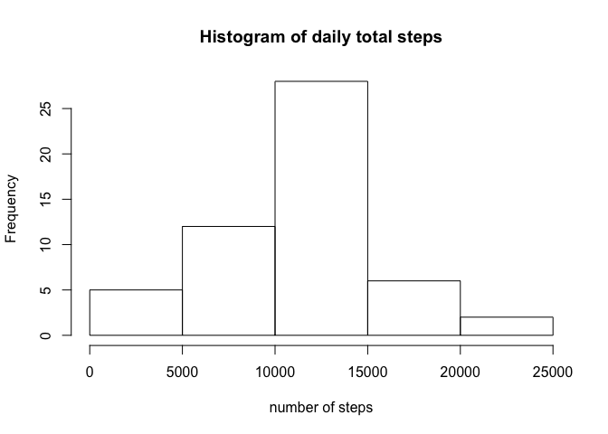
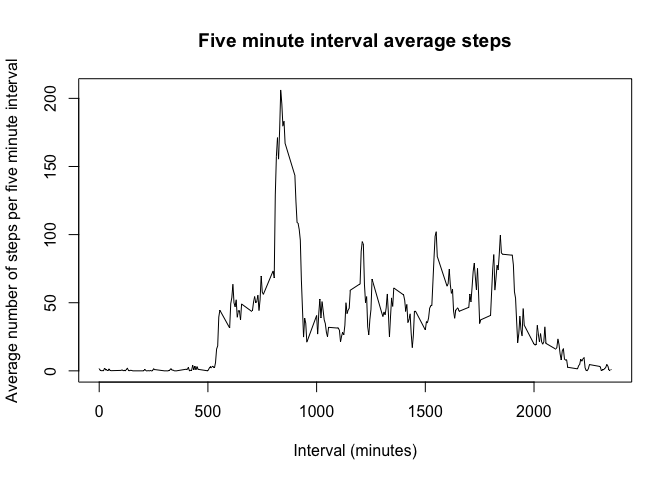
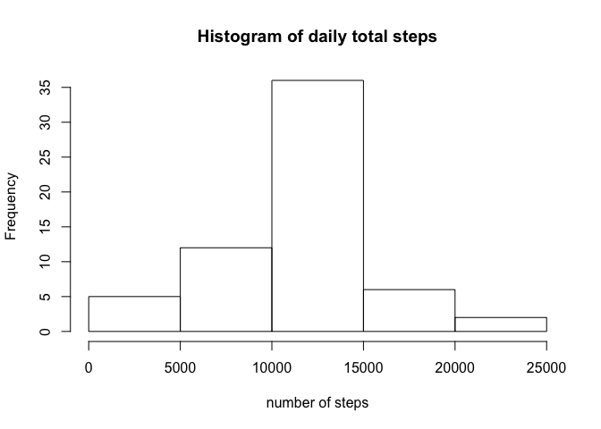
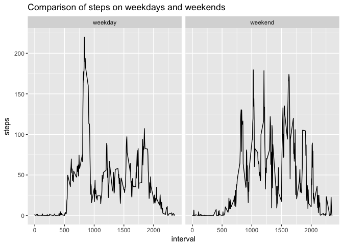

# Reproducible Research: Peer Assessment 1


## Loading and preprocessing the data

```r
##read in data
activity <- read.csv("activity.csv", header = TRUE)

##convert date data from dactor to date
activity$date <- as.Date(activity$date, format = "%Y-%m-%d")
```

## What is mean total number of steps taken per day?

```r
##find total number of steps per day
daily_total <- aggregate(steps~date, activity, sum)

##plot histogram of total steps per day
hist(daily_total$steps, main = "Histogram of daily total steps", xlab = "number of steps")
```

<!-- -->

```r
##find mean number of steps
mean(daily_total$steps)
```

```
## [1] 10766.19
```

```r
##find median number of steps
median(daily_total$steps)
```

```
## [1] 10765
```

## What is the average daily activity pattern?

```r
##find average for each five minute interval
interval_average <- aggregate(steps~interval, activity, mean)

##plot five minute interval average
plot(interval_average$interval, interval_average$steps, type = "l", main = "Five minute interval average steps", xlab = "Interval (minutes)", ylab = "Average number of steps per five minute interval")
```

<!-- -->

```r
##find five minute interval with max number of steps
interval_average$steps[which.max(interval_average$steps)]
```

```
## [1] 206.1698
```

## Imputing missing values
Missing values will be replaced with the  mean for that five minute interval and then a new activity data set will be made

```r
##count number of NAs in the steps column
sum(is.na(activity$steps))
```

```
## [1] 2304
```

```r
##replace missing values with the mean for that five minute interval and make a new activity data set (activity.complete)
activity.complete <- activity
i <- 0
j <- 0

for(i in 1:length(activity.complete$steps)) {
  j <- activity.complete$interval[i]
  if(activity.complete$steps[i] %in% NA) {
    activity.complete$steps[i] <-          
      interval_average$steps[interval_average$interval == j] 
  }
  i <- i + 1
}

##find total number of steps per day
daily_total.complete <- aggregate(steps~date, activity.complete, sum)

##plot histogram of total steps per day
hist(daily_total.complete$steps, main = "Histogram of daily total steps", xlab = "number of steps")
```

<!-- -->

```r
##find mean number of steps
mean(daily_total.complete$steps)
```

```
## [1] 10766.19
```

```r
##find median number of steps
median(daily_total.complete$steps)
```

```
## [1] 10766.19
```

## Are there differences in activity patterns between weekdays and weekends?

```r
##convert dates to days of the week
days <- weekdays(activity.complete$date)

##create two-level factor variable patterns with levels of weekend and weekday
patterns <- matrix(1:length(days))
i <- 1
for(i in 1:length(days)) {
  if(days[i] == "Saturday") {
    patterns[i] <- "weekend"
  }
  if(days[i] == "Sunday") {
    patterns[i] <- "weekend"
  }
  else { 
    patterns[i] <- "weekday"
  }
  i <- i + 1
}

##add patterns factor to dataset
activity.complete <- cbind(activity.complete,patterns)

##find average steps by interval across weekdays and weekends
pattern_average <- aggregate(steps~interval + patterns, activity.complete, mean)

##plot steps by weekend or weekday
library(ggplot2)
qplot(interval, steps, data=pattern_average, facets = .~patterns,  geom = "line", main = "Comparison of steps on weekdays and weekends")
```

<!-- -->
